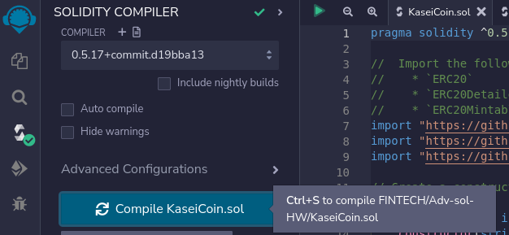
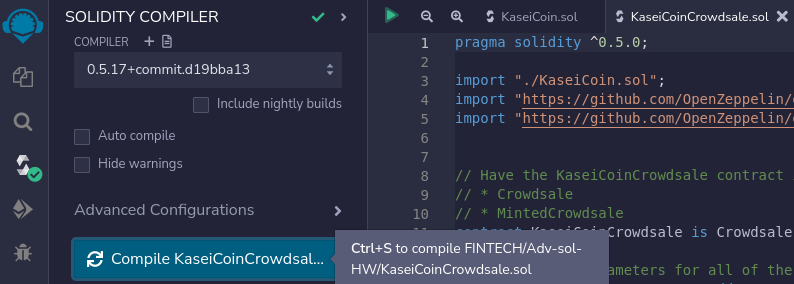
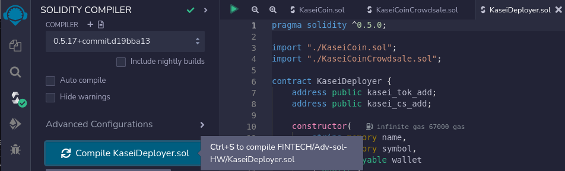
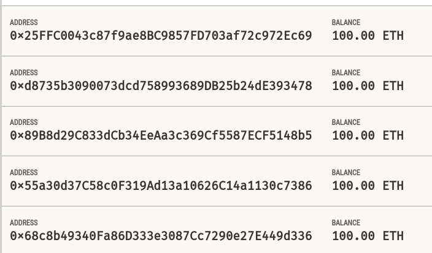
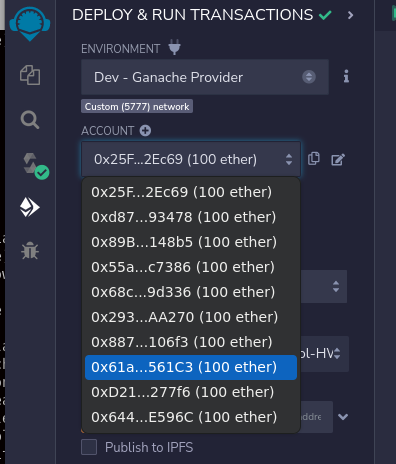
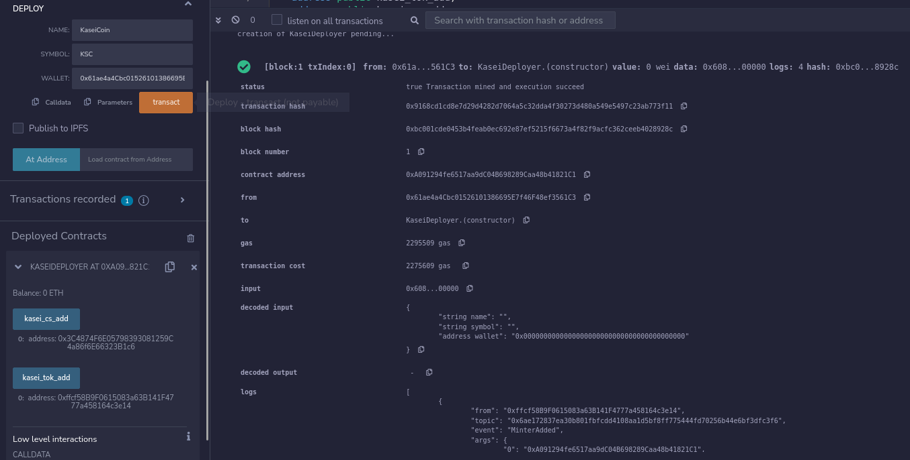
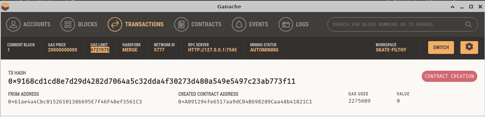
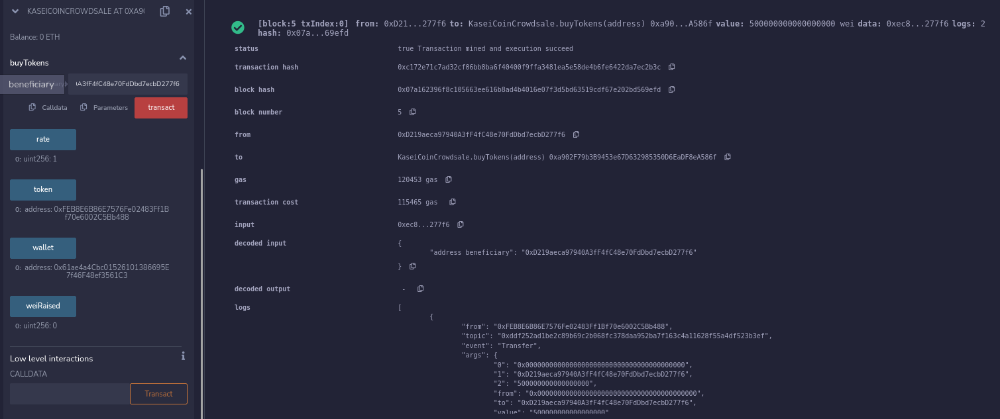
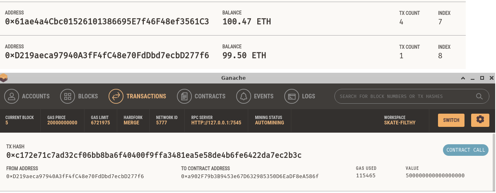
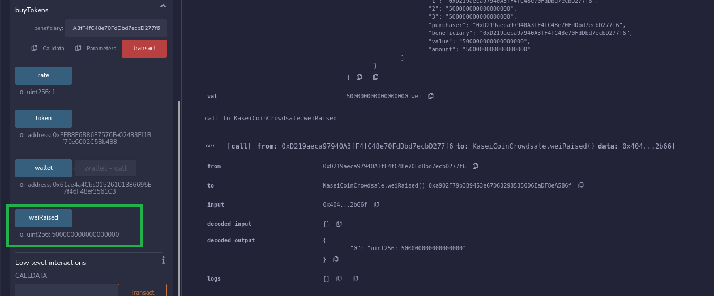

# Module 19 - Advanced Solidity

This is the page for the twenty-first module of the Fintech Bootcamp course, covering Advanced Solidity.

This page is a continuation of my GitHub learning structure for this course.

Above you will see the *^*.sol files for this homework along with Excuted_Results for the README.

## Martian Token Crowdsale

This week, we needed to create a fungible ERC-20 compliant token launched via a crowdsale allowing coversion.

All the transaction details are shown in the execution results below.

## Crowdsale Execution

* __*1 - Solidity Compilation*__
   
  Below shows the compilation of each of the solidity code files.

KaseiCoin.sol 
  

 

KaseiCoinCrowdsale.sol 
  

 

KaseiDeployer.sol 
  

 

 * __*2 - Ganache & Remix Integration*__
   
  Below shows the Ganace accounts and shown in Remix

Ganache  
  

 

Remix  
  

 

* __*3 - Contract Deployment*__
 
  Using the KaseiDeployer to deploy the contract

  

 

Transaction in Ganache

  

 

  
 __*3 - Crowdsale Transaction*__
 
  Account transactions using the crowdsale

  

 

Transaction in Ganache between accounts

  

 

Funds raised

  

 

## Back to Fintech Home

* [Fintech Bootcamp Home](https://github.com/d4np3/fintech)
